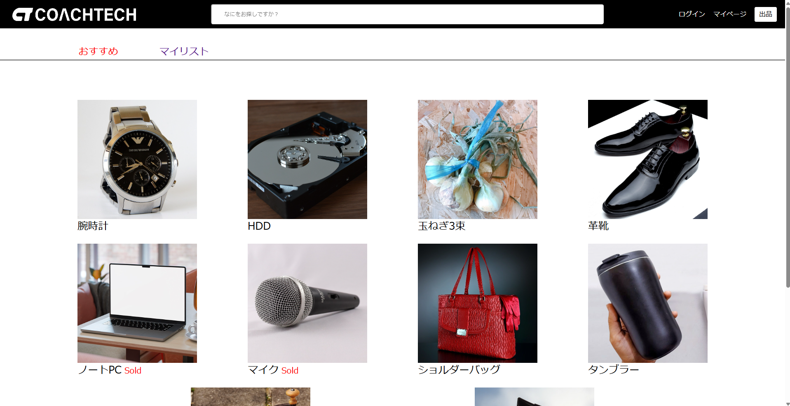
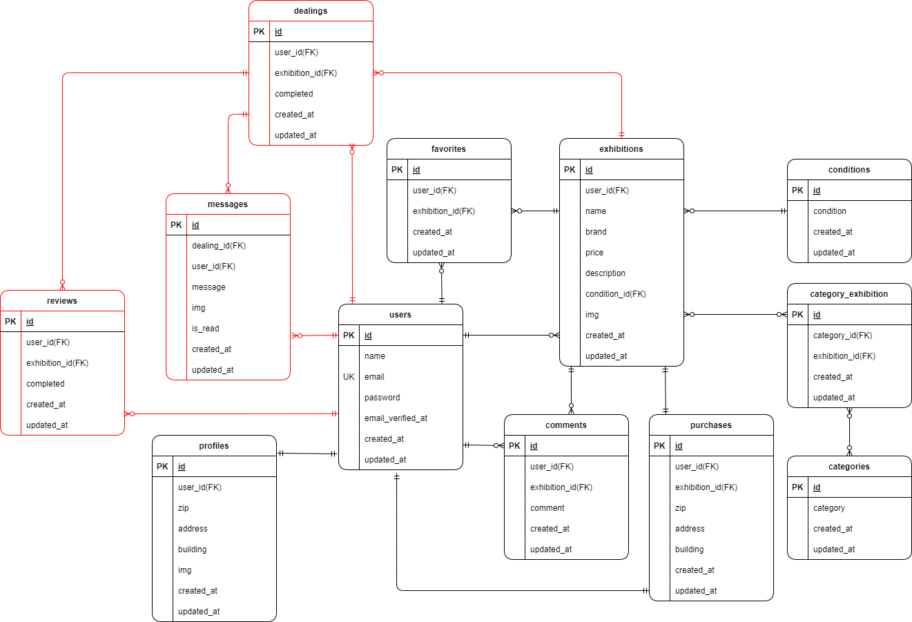
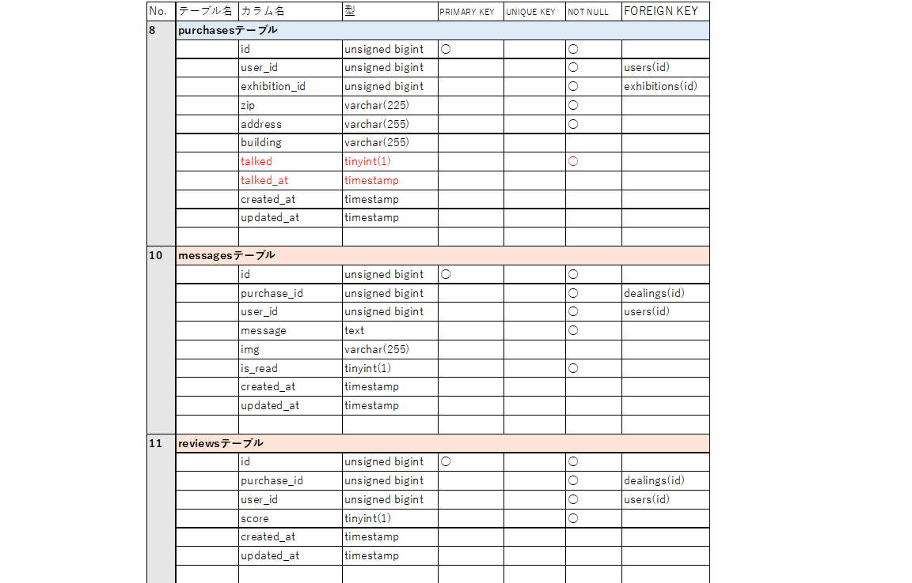

# coachtech フリマ

ある企業が開発した独自のフリマアプリ


## 作成した目的

アイテムの出品と購入を行うため。

## アプリケーション URL

・ 開発環境：http://localhost/

・ phpMyAdmin：http://localhost:8080

## 他のリポジトリ

### ストレージ

商品画像保存：/src/storage/app/public/images/items/

プロフィール画像保存：/src/storage/app/public/images/profiles/

## 使用技術

・PHP 8.1.29

・Laravel 10.48.28

・phpMyAdmin 5.2.1

・MySQL 8.0.26

・nginx 1.21.1

## ER 図



図の赤色部分は追加機能実装部（赤色部が反映されない場合は画像をクリックする）

# 環境構築

## 1．Docker ビルド

1-1．git clone リンク

1-2．DockerDesktop アプリを立ち上げる

MySQL は、docker-compose.yml ファイルを編集する。

1-3．docker-compose up -d --build

## 2．Laravel 環境構築

2-1．コンテナ内にログイン

```
docker-compose exec php bash
```

2-2．composer.json に記載されたパッケージのリストをインストールする

```
⁠composer install
```

2-3．.env.example ファイルから.env ファイルを作成し、環境変数を変更、以下の設定を追加
【Mail 設定】

```
MAIL_MAILER=smtp
MAIL_HOST=smtp.example.com
MAIL_PORT=587
MAIL_USERNAME=your_username
MAIL_PASSWORD=your_password
MAIL_ENCRYPTION=tls
MAIL_FROM_ADDRESS=your_email@example.com
MAIL_FROM_NAME="${APP_NAME}"
```

【API キー設定】

```
STRIPE_KEY=your_publishable_key
STRIPE_SECRET=your_secret_key
```

2-4．アプリケーションを実行できるように、PHP コンテナで以下のコマンドを実行する

```
php artisan key:generate
```

2-5．マイグレーションを実行する

```
⁠php artisan migrate
```

2-6．シーディング処理を実行する。

```
php artisan db:seed
```

2-7．シンボリックリンクの作成

```
php artisan storage:link
```

## 会員情報登録後のページ遷移について

案件シートのテストケース一覧では、会員情報登録後にログイン画面に遷移するとなっている。

しかし、画面設計ではメール認証誘導画面に遷移することになっている。

本アプリでは、会員情報登録後にメール認証誘導画面に遷移するようにした。

## 追加機能実装（2025/05/03 追加）（2025/05/17 修正）（2025/05/21 追記）

### チャット機能の追加

商品を購入するとマイページにある取引中の商品リストに追加される。

そこから商品画像を押下すると取引画面に遷移できる。

送信したメッセージ下にある編集ボタンからはメッセージの編集はできるが、送信した画像を編集することはできない。

取引の終了は購入者が行う。購入者が取引の終了をするには、取引画面の「取引を完了する」ボタンを押下し表示される取引完了モーダルからユーザーの評価を行う。（追記）

出品者が、購入者が終了した取引ページに遷移するとユーザー評価モーダルが表示される。（追記）

評価を送信した後、「送信する」ボタンを再度クリックする等の操作はせず、商品一覧画面に自動的に遷移するまで待つ。

評価を行った商品はマイページの取引中の商品リストに表示されなくなる。

### Route,Controller(追加のみ)

| 画面名称 | パス  | メソッド | ルート先コントローラー | アクション | 認証必須 | 説明       |
| -------- | ----- | -------- | ---------------------- | ---------- | -------- | ---------- |
| 取引画面 | /chat | GET      | ChatController         | index      | 〇       | 取引ページ |

### Model(追加のみ)

| モデルファイル名 | 説明                                  |
| ---------------- | ------------------------------------- |
| Message          | Messages テーブルを操作するために使用 |
| Review           | Reviews テーブルを操作するために使用  |

### View(追加のみ)

| 画面名称           | blade ファイル名              |
| ------------------ | ----------------------------- |
| 取引画面           | chat.blade.php                |
| 取引完了通知メール | emails/notification.blade.php |

### バリデーション(追加のみ)

| バリデーションファイル名 | フォーム | ルール                     |
| ------------------------ | -------- | -------------------------- |
| ChatRequest.php          | 本文     | 入力必須、400 文字以内     |
|                          | 画像     | 拡張子が.jpeg もしくは.png |
| ReviewRequest.php        | 評価     | 入力必須                   |

### テーブル仕様書(追加のみ)



### ユーザーデータ

ユーザーのダミーデータを 3 つ作成した．

| Name         | Email address        | Password | Exhibition ID  |
| ------------ | -------------------- | -------- | -------------- |
| 出品太郎     | seller01@example.com | abcd1234 | 1, 2, 3, 4, 5  |
| 出品次郎     | seller02@example.com | abcd1234 | 6, 7, 8, 9, 10 |
| ユーザー花子 | test@example.com     | wasd5678 |                |

### 追加ストレージ

チャット送信画像保存：/src/storage/app/public/images/chat/
