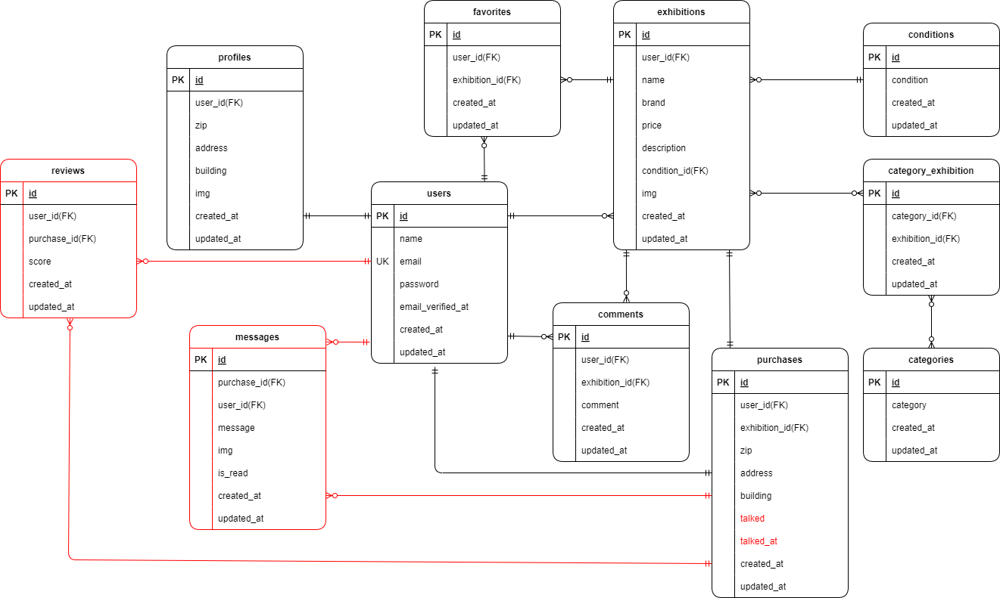

# coachtech フリマ

ある企業が開発した独自のフリマアプリ


## 作成した目的

アイテムの出品と購入を行うため。

## アプリケーション URL

・ 開発環境：http://localhost/

・ phpMyAdmin：http://localhost:8080

## 他のリポジトリ

### ストレージ

商品画像保存：/src/storage/app/public/images/items/
プロフィール画像保存：/src/storage/app/public/images/profiles/

## 機能一覧

案件シートの機能要件ページを参照

## 使用技術

・PHP 8.1.29
・Laravel 10.48.28
・phpMyAdmin 5.2.1
・MySQL 8.0.26
・nginx 1.21.1

## ER 図



# 環境構築

## 1．Docker ビルド

1-1．git clone リンク

1-2．DockerDesktop アプリを立ち上げる
MySQL は、docker-compose.yml ファイルを編集する。

1-3．docker-compose up -d --build

## 2．Laravel 環境構築

2-1．コンテナ内にログイン

```
docker-compose exec php bash
```

2-2．composer.json に記載されたパッケージのリストをインストールする

```
⁠composer install
```

2-3．.env.example ファイルから.env ファイルを作成し、環境変数を変更、以下の設定を追加
【Mail 設定】

```
MAIL_MAILER=smtp
MAIL_HOST=smtp.example.com
MAIL_PORT=587
MAIL_USERNAME=your_username
MAIL_PASSWORD=your_password
MAIL_ENCRYPTION=tls
MAIL_FROM_ADDRESS=your_email@example.com
MAIL_FROM_NAME="${APP_NAME}"
```

【API キー設定】

```
STRIPE_KEY=your_publishable_key
STRIPE_SECRET=your_secret_key
```

2-4．アプリケーションを実行できるように、PHP コンテナで以下のコマンドを実行する

```
php artisan key:generate
```

2-5．マイグレーションを実行する

```
⁠php artisan migrate
```

2-6．シーディング処理を実行する。

```
php artisan db:seed
```

2-7．シンボリックリンクの作成

```
php artisan storage:link
```

## 会員情報登録後のページ遷移について

案件シートのテストケース一覧では、会員情報登録後にログイン画面に遷移するとなっている。
しかし、画面設計ではメール認証誘導画面に遷移することになっている。
本アプリでは、会員情報登録後にメール認証誘導画面に遷移するようにした。
